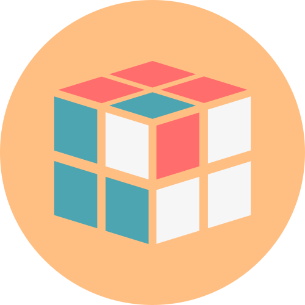

<p align="center">
  
  <br>
  <br>
  <a href="https://github.com/NonlinearFruit/Quber/actions?query=workflow%3Adotnet-core"></a>
  <a href="https://codecov.io/gh/NonlinearFruit/Quber"></a>
</p>

<h1 style="text-align:center">Quber</h1>

Programmatically manipulate and interact with a Rubik's cube

## Examples

Print the cube to the terminal
```C#
var cube = new Cube();
var printer = new CubePrinter();

printer.Print(cube);
```

Rotate a face
```C#
var cube = new Cube();

cube.Rotate(Face.Up, Rotation.Type.Clockwise);
```

Execute an algorithm
```C#
var cube = new Cube();

cube.Rotate("U2 D2 F2 B2 R2 L2");
```

Or even create a NxN cube
```C#
var cube = new Cube(5);
var printer = new CubePrinter();

printer.Print(cube);
```

## Screenshots

**Rotate Faces** <br>
![Rotate Faces][rotatefaces] <br>
<br>
**Checkers** <br>
![Checkers][checkers]<br>
![Checkers 5x5][checkers5x5]<br>

[rotatefaces]: https://github.com/NonlinearFruit/Quber/blob/master/screenshots/RotateFaces.gif
[checkers]: https://github.com/NonlinearFruit/Quber/blob/master/screenshots/Checkers.gif
[checkers5x5]: https://github.com/NonlinearFruit/Quber/blob/master/screenshots/Checkers5x5.gif
